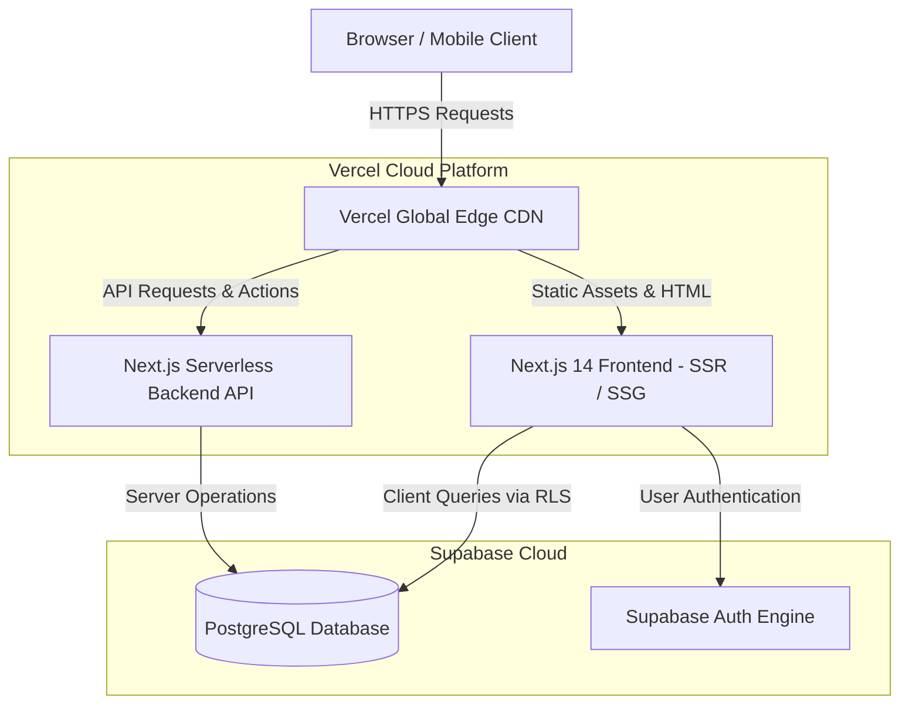

# CSEEL Platform: Complete Deployment & Architecture Guide

This document outlines the architecture for deploying the CSEEL application with **Frontend & Backend on Vercel** and **Database & Authentication on Supabase**.

---

## 🏛️ System Architecture Overview

---

## 📁 Key Deployment Files Created in Project

1. **`vercel.json`** (`/vercel.json`):
   - Configures Next.js 14 framework preset, global security headers (XSS Protection, Frame Options), caching rules, and asset optimization.
2. **`.env.example`** (`/.env.example`):
   - Template for all Supabase API keys (`NEXT_PUBLIC_SUPABASE_URL`, `NEXT_PUBLIC_SUPABASE_ANON_KEY`) and site URL.
3. **`supabase/schema.sql`** (`/supabase/schema.sql`):
   - Complete PostgreSQL SQL script creating tables (`profiles`, `user_roles`, `organisations`, `classes`, `assignments`, `experiments`, `admin_audit_logs`), triggers, and Row Level Security (RLS) policies.
4. **`docs/ALL_PLATFORM_CREDENTIALS.csv`** (`/docs/ALL_PLATFORM_CREDENTIALS.csv`):
   - Excel spreadsheet with all 23 platform logins (Admins, Students, Teachers, Schools).

---

## 🚀 Step-by-Step Deployment Instructions

### Step 1: Set Up Supabase Database & Auth
1. Go to **[supabase.com](https://supabase.com)** and create a new project.
2. Open **SQL Editor** in your Supabase dashboard.
3. Paste the contents of [`supabase/schema.sql`](file:///d:/Projects/cseel_next/cseel-next/supabase/schema.sql) and click **RUN**.
4. Go to **Project Settings** ➔ **API** and copy:
   - `Project URL`
   - `anon public key`

### Step 2: Deploy to Vercel (Frontend + Serverless Backend)
1. Go to **[vercel.com](https://vercel.com)** ➔ Click **"Add New Project"**.
2. Select your repository or run `npx vercel --prod`.
3. In **Environment Variables**, add:
   - `NEXT_PUBLIC_SUPABASE_URL` = *(Your Supabase URL)*
   - `NEXT_PUBLIC_SUPABASE_ANON_KEY` = *(Your Supabase Anon Key)*
   - `NEXT_PUBLIC_SITE_URL` = `https://your-domain.com`
4. Click **Deploy**. Vercel will automatically build both Frontend and Serverless Backend functions.
